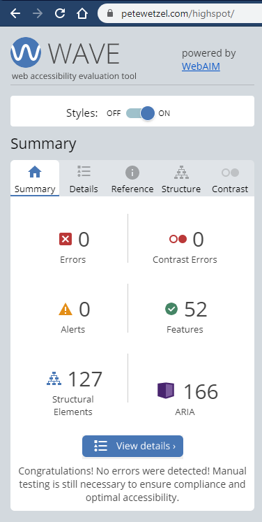

# highspot
Highspot coding exercise
Demo: [https://www.petewetzel.com/highspot/](https://www.petewetzel.com/highspot/)

### Problem Description
Create a card listing app for "Elder Scrolls Legends" the game

Implement a solution that meets the following criteria:
- [ ] Show results in a card grid format with the image prominently displayed.
- [ ] Each card displays: **Image**, **Name**, **Text**, **Set Name**, and **Type**. Additional fields are optional.
- [ ] Use the API to sort the results alphabetically by card **Name**.
- [ ] Display a loading indicator when communicating with the API.
- [ ] Use a responsive design that accommodates, at minimum, desktop and mobile.
- [ ] Initially, fetch and display the first 20 results returned by the API.
- [ ] As the user scrolls down the page, load and append additional cards using "infinite scroll."
- [ ] Retrieve additional pages of results as needed but do not load more than 20 cards with each request.
- [ ] Use modern open source web technologies to implement your solution (React, Backbone, Angular, Vue, Underscore, etc.).
- [ ] Provide instructions for prerequisites, installation, and application setup and build in a README file.

### API to use
 Documentation: [https://docs.elderscrollslegends.io/](https://docs.elderscrollslegends.io/)

Example of the get all cards API with the 20 cards per page request:
[https://api.elderscrollslegends.io/v1/cards?pageSize=20](https://api.elderscrollslegends.io/v1/cards?pageSize=20)

### View Live Demo
View the generated code at [petewetzel.com/highspot/](https://www.petewetzel.com/highspot/)

## Features
1. Responsive Design
1. Linting and Unit Testing
1. PropTypes for type checking 
1. Accessibility via Wave Tool https://wave.webaim.org/

### Development Environment

1. Install [Node.js](https://nodejs.org/en/).  
   - This app was built and tested using version 10.16.0
1. Install [yarn](https://yarnpkg.com/lang/en/). This submission was developed and tested using yarn 1.19.2.
   - This app was built and tested using version 1.21.1
1. Install dependencies by executing the following command:

   ```
   yarn
   ```

1. To start the webapp in development mode:

   ```
   yarn start
   ```

1. This should open up a browser for you, but if not, open up your browser of choice and go to [http://localhost:3000/](http://localhost:3000/)

### Linting

To run eslint:

```
yarn lint
```

### Some Features to take note of
1. **Filters** - Added the ability to filter down which cards to display
1. **Filter Lookups** - Once I saw there were other services that could be used as lookups, I added them to the filters to make them select boxes
1. **Filter Lookup Fallback** - If the filter lookup XHR requests fails, it fails gracefully to be input textboxes instead of select dropdowns to still allow search functionality
1. **Good Scores on Accessibility, Best Practices, and SEO** - Used the WAI Wave tool for accessibility testing and the Google Lighthouse tool to develop and audit.





### Notes that I came across along the way
1. **Lack of Sort/Order filter in the API** - The problem description asks that to be sorted by name and also only retrieve 20 cards at a time.  Without the guarantee that the cards are presorted by name, each page request could contain cards that would be sorted into previously displayed page.  This creates an odd UX as a new card may not be visible or noticeable to the user due to it being sorted in between previously painted cards. The other option would be to sort per page, but that would give an odd experience as well as the user would be seeing new sets of A-Z cards per each 20 cards.<br /><br />

## Todo List
- [ ] Improve code coverage and include more indepth tests
- [ ] Add a Service Worker and other Progressive Web App enhancements
- [ ] Improve UX on filters that are a range. (Possible solution: Use a slider control for filters that are ranges (ex. cost))
- [ ] Add styling as card images come in
- [ ] Keep DOM light by only rendering cards as you get closer to having them being in the viewport

This project was bootstrapped with [Create React App](https://github.com/facebook/create-react-app).